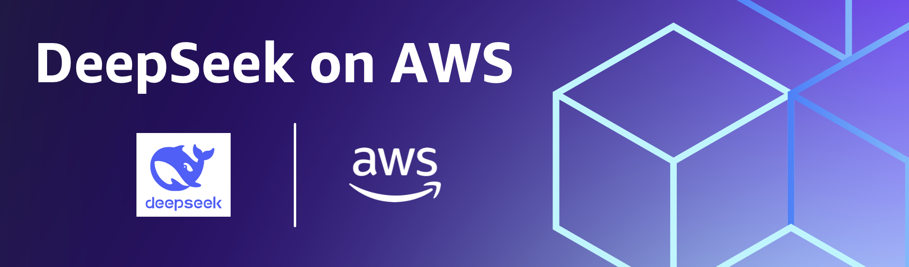

## DeepSeek on AWS examples

Welcome to the repository hosting example use of DeepSeek models on AWS! 
Open a PR if you would like to contribute! :twisted_rightwards_arrows:

## What's New

- [DeepSeek-R1 model now available in Amazon Bedrock Marketplace and Amazon SageMaker JumpStart](https://aws.amazon.com/blogs/machine-learning/deepseek-r1-model-now-available-in-amazon-bedrock-marketplace-and-amazon-sagemaker-jumpstart/): This blog post discusses how to get started with DeepSeek-R1 on Amazon Bedrock Marketplace and SageMaker JumpStart. 

- [Deploy DeepSeek-R1 distilled Llama models with Amazon Bedrock Custom Model Import](https://aws.amazon.com/blogs/machine-learning/deploy-deepseek-r1-distilled-llama-models-with-amazon-bedrock-custom-model-import/): This blog post discusses how to deploy R1 Distilled Llama models on Amazon Bedrock using Custom Model Import, which enables the import and use of your customized models alongside existing FMs through a single serverless, unified API. 

- [Protect your DeepSeek model deployments with Amazon Bedrock Guardrails](https://aws.amazon.com/blogs/machine-learning/protect-your-deepseek-model-deployments-with-amazon-bedrock-guardrails/): This blog post provides a comprehensive guide to implementing robust safety protections for DeepSeek-R1 and other open weight models using Amazon Bedrock Guardrails. We’ll explore: 

## Notebooks 

New Releases coming soon

## Security

See [CONTRIBUTING](CONTRIBUTING.md#security-issue-notifications) for more information.

## License

This library is licensed under the MIT-0 License. See the LICENSE file.

